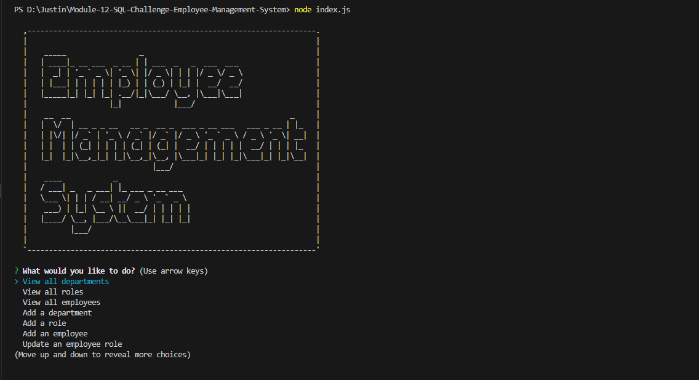
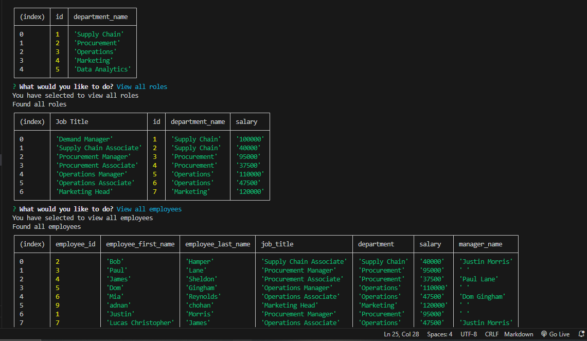
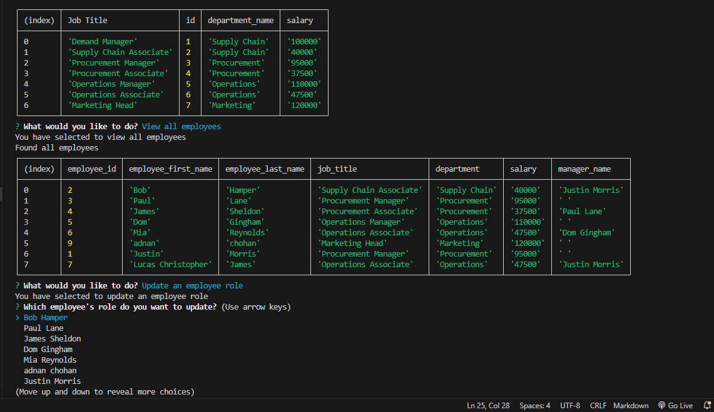

# Module-12-SQL-Challenge-Employee-Management-System
Employee Management System using Node.js and PostgresSQL

 ## Description
 This is the best Employee Management System to keep track of employees data such as their roles, salaries, department & reporting managers.

 ## User Story
AS A business owner
 
I WANT to be able to view and manage the departments, roles, and employees in my company
 
SO THAT I can organize and plan my business

## WalkThrough Video

## Installation

 Install the following:
  
 npm install node.js
  
 npm install inquirer, pg, asciiart-logo
  

 ## Prerequisites
 PgAdmin 4, PostgresSQL 15 

 ## Preview
 

 

 

 ## License

 

 This project is licensed under the [MIT License](https://choosealicense.com/licenses/mit/) license.

 ## Contributing

 Pull requests are most welcome

 ## Queries

 GitHub: https://github.com/jmorris38

 Email: jmorris38@outlook.com

